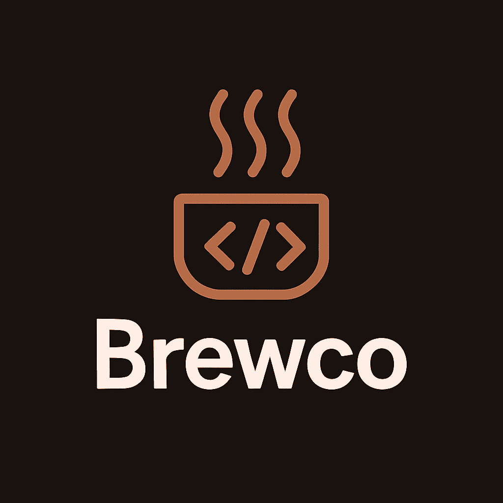

<div align="center">



# ☕ Brewco ☕
### *A delightfully coffee-themed programming language that makes coding as enjoyable as your morning brew!*


---

<!--
@author: Khushi Motwani 💖
@passion_project: "Making programming as warm and welcoming as coffee" ☕
@hours_invested: "Countless, fueled by endless espresso" ⚡
@motivation: "Life's too short for boring programming languages!"

Hey there! This is my baby - Brewco! 
Every feature, every function name, every line of documentation 
was crafted with love and probably too much caffeine ☕😅

Hope you fall in love with this language as much as I did creating it!
- Khushi ✨
-->

[](https://www.rust-lang.org/)
[](https://github.com/khushimotwani/brewco)
[](https://opensource.org/licenses/MIT)
[](https://github.com/khushimotwani/brewco)

*Brewco is a modern, object-oriented programming language with coffee-inspired syntax that brings warmth and fun to programming. Whether you're a coffee enthusiast or just love quirky programming languages, Brewco offers a full-featured development experience with a unique twist.*

---

</div>

## 🌟 **Features That Will Make You Love Coding Again** 

<table>
<tr>
<td>

### ☕ **Core Language Features**
- **Coffee-themed syntax** - Keywords like `beans`, `brew`, `taste`, `steep`, `pour`
- **Object-oriented programming** - Classes (`bean`) and interfaces (`coffee_recipe`)
- **Strong type system** - Static type checking with type inference
- **Interactive REPL** - Coffee shop experience for testing code

</td>
<td>

### ⚡ **Advanced Capabilities**
- **Rich standard library** - 30+ built-in functions for strings, arrays, math, I/O, and more
- **Modern control flow** - If/else, loops (including `pour` loops), switch statements, try/catch
- **Full module system** - Coffee Bean Roastery with import/export capabilities using `grind`
- **Package management** - Coffee Package Roastery for dependency management

</td>
</tr>
<tr>
<td>

### 🔧 **Developer Experience**
- **File I/O system** - Coffee File Brewery for reading/writing files with templates
- **Performance optimization** - Turbo Espresso Compiler infrastructure for fast execution
- **Enhanced error handling** - Coffee Spill Reports with barista wisdom and context
- **Advanced pour loops** - `pour item in collection` syntax for elegant iteration

</td>
<td>

### 🎯 **Professional Ready**
- **VS Code Extension** - Full IDE support with IntelliSense, syntax highlighting, and debugging
- **Comprehensive documentation** - Complete language reference and examples
- **Testing framework** - Built-in testing capabilities
- **Performance monitoring** - Built-in profiling and optimization
- **Extensible architecture** - Ready for community contributions

</td>
</tr>
</table>

---

## 🚀 **Quick Installation & Setup**

### **🎨 VS Code Extension (Recommended)**
Get the best Brewco development experience with our official VS Code extension!

[](https://marketplace.visualstudio.com/items?itemName=khushimotwani.brewco)

**Features:**
- ✨ **Beautiful syntax highlighting** for all Brewco features
- 🧠 **IntelliSense** with 30+ native function completions
- 📝 **Code snippets** and templates for rapid development
- 🚀 **One-click execution** and REPL integration
- 💡 **Hover documentation** for instant help

**Installation:**
1. Open VS Code
2. Search for "**Brewco**" in Extensions
3. Install the extension by **Khushi Motwani**
4. Start brewing amazing code! ☕

### **⚙️ Manual Installation**
```bash
# 📥 Clone the repository
git clone https://github.com/khushimotwani/brewco.git
cd brewco

# 🔨 Build the interpreter
cargo build --release

# ☕ Run a Brewco file
cargo run hello.brewco

# 🎮 Start interactive mode
cargo run repl
```

---

## 🎯 **Quick Start - Your First Coffee** 

### 👋 Hello World
```brewco
🎀 Welcome to Brewco! ☕
pourout "Hello, Coffee World! ☕✨"
```

### 🧮 Variables and Types
```brewco
🎀 Variable declarations with coffee-themed keywords
beans message = "Fresh coffee!"     🎀 String ☕
beans count = 42                    🎀 Number 🔢
beans is_fresh = true              🎀 Boolean ✅
beans my_cup = [1, 2, 3]          🎀 Array 📋
beans coffee_shop = {              🎀 Object 🏪
    name: "The Daily Grind",
    rating: 5.0,
    specialty: "Espresso"
}
```

### 🍃 Functions (Brews)
```brewco
🎀 Define a coffee brewing function ☕
brew make_coffee(type: String, shots: Number) -> String {
    beans result = brew_blend("Making delicious ", type)
    beans final_brew = brew_blend(result, " with ", shots, " shots ☕")
    serve final_brew
}

🎀 Brew some coffee! ☕
beans my_order = make_coffee("espresso", 2)
pourout my_order  🎀 Output: "Making delicious espresso with 2 shots ☕"
```

### 🔄 Enhanced Pour Loops
```brewco
🎀 Elegant iteration with pour loops ☕
beans coffee_menu = ["espresso", "latte", "cappuccino", "americano"]

pour drink in coffee_menu {
    beans fancy_name = foam_up(drink)  🎀 Convert to uppercase ⬆️
    beans drink_length = string_length(drink)
    pourout "☕", fancy_name, "- Characters:", drink_length
}
```

---

## 📚 **Complete Native Functions Library**

<details>
<summary><strong>🧮 Mathematical Functions (9 functions)</strong></summary>

| **Function** | **Description** | **Example** |
|--------------|-----------------|-------------|
| `root_drip(n)` | Square root calculation | `root_drip(16)` → `4.0` |
| `absolute_aroma(n)` | Absolute value | `absolute_aroma(-7.5)` → `7.5` |
| `round_up_the_grounds(n)` | Ceiling function | `round_up_the_grounds(4.2)` → `5.0` |
| `settle_the_grounds(n)` | Floor function | `settle_the_grounds(4.8)` → `4.0` |
| `extra_shot(base, exp)` | Power function | `extra_shot(2, 3)` → `8.0` |
| `perfect_temperature(n)` | Square root (alias) | `perfect_temperature(25)` → `5.0` |
| `brewing_time()` | Current timestamp | `brewing_time()` → current time |
| `brew_minimum(array)` | Find minimum value | `brew_minimum([3, 1, 4])` → `1` |
| `brew_maximum(array)` | Find maximum value | `brew_maximum([3, 1, 4])` → `4` |

</details>

<details>
<summary><strong>📝 String Functions (10 functions)</strong></summary>

| **Function** | **Description** | **Example** |
|--------------|-----------------|-------------|
| `string_length(s)` | Get string length | `string_length("Brewco")` → `6` |
| `brew_blend(s1, s2)` | Concatenate strings | `brew_blend("Coffee", "Lang")` → `"CoffeeLang"` |
| `foam_up(s)` | Convert to uppercase | `foam_up("espresso")` → `"ESPRESSO"` |
| `settle_down(s)` | Convert to lowercase | `settle_down("LATTE")` → `"latte"` |
| `grind_to_pieces(s, delim)` | Split string | `grind_to_pieces("a,b,c", ",")` → `["a", "b", "c"]` |
| `filter_grounds(s, chars)` | Remove characters | `filter_grounds("Hello123", "123")` → `"Hello"` |
| `first_sip(s)` | Get first character | `first_sip("Brewco")` → `"B"` |
| `pour_together(arr, sep)` | Join array to string | `pour_together(["A", "B"], " ")` → `"A B"` |
| `extract_brew(s, start, len)` | Extract substring | `extract_brew("Hello", 1, 3)` → `"ell"` |
| `reverse_pour(s)` | Reverse string | `reverse_pour("Brewco")` → `"ocwerB"` |

</details>

<details>
<summary><strong>📋 Array Functions (3 functions)</strong></summary>

| **Function** | **Description** | **Example** |
|--------------|-----------------|-------------|
| `cup_size(arr)` | Get array length | `cup_size([1, 2, 3])` → `3` |
| `add_to_cup(arr, item)` | Add element to array | `add_to_cup([1, 2], 3)` → `[1, 2, 3]` |
| `cup_add(arr, item)` | Add element (alias) | `cup_add([1, 2], 3)` → `[1, 2, 3]` |

</details>

<details>
<summary><strong>🔍 Type Checking Functions (6 functions)</strong></summary>

| **Function** | **Description** | **Example** |
|--------------|-----------------|-------------|
| `is_brew(value)` | Check if function | `is_brew(my_function)` → `true/false` |
| `is_number(value)` | Check if number | `is_number(42)` → `true` |
| `is_string(value)` | Check if string | `is_string("hello")` → `true` |
| `is_cup(value)` | Check if array | `is_cup([1, 2, 3])` → `true` |
| `is_boolean_bean(value)` | Check if boolean | `is_boolean_bean(true)` → `true` |
| `coffee_strength_check(n)` | Validate coffee strength | `coffee_strength_check(8.5)` → `true` |

</details>

<details>
<summary><strong>🎲 Utility Functions (2 functions)</strong></summary>

| **Function** | **Description** | **Example** |
|--------------|-----------------|-------------|
| `random_bean()` | Generate random number | `random_bean()` → `0.0-1.0` |
| `good_coffee_naming(name)` | Validate coffee naming | `good_coffee_naming("my_var")` → `true/false` |

</details>

---

## 📂 **Coffee File I/O System**

Brewco features a comprehensive file system with coffee-themed operations:

<details>
<summary><strong>📁 File Operations</strong></summary>

```brewco
🎀 Reading coffee recipes ☕
beans recipe_content = sip_file("my_recipe.brewco")
beans file_exists = recipe_exists("secret_recipe.brewco")

🎀 Writing coffee logs ☕
beans success = pour_to_file("daily_log.txt", "Today's brew was perfect!")

🎀 Scanning the coffee pantry ☕
beans all_recipes = scan_pantry("recipes/")
beans recipe_count = cup_size(all_recipes)

🎀 Coffee file templates ☕
beans new_recipe = brew_new_recipe("my_blend", "advanced")
```

**Available Templates:**
- `"basic"` - Simple coffee recipe with variables and functions
- `"bean"` - Object-oriented coffee shop class template  
- `"advanced"` - Full-featured template with all language constructs

</details>

---

## 🏗️ **Advanced Architecture**

### ⚡ **Turbo Espresso Compiler**
Brewco features a sophisticated bytecode compilation system:

```brewco
🎀 Performance optimization levels ☕
- DecafMode: No optimizations (debug)
- SingleShot: Basic optimizations
- DoubleShot: Standard optimizations  
- TripleShot: Aggressive optimizations
- TurboEspresso: Maximum performance
```

**Features:**
- 🚀 **JIT Compilation** - Just-in-time bytecode execution
- 🧠 **Smart Optimizations** - Dead code elimination, function inlining
- 📊 **Performance Profiling** - Real-time execution metrics
- 💾 **Memory Management** - Automatic garbage collection and pooling

### 🤖 **Barista Language Server**
Full-featured language server protocol implementation:

**IDE Features:**
- 💡 **IntelliSense** - Context-aware completions for 30+ functions
- 🔍 **Hover Documentation** - Instant help for coffee functions
- 🚨 **Real-time Diagnostics** - Beautiful error messages with barista wisdom
- 📋 **Code Snippets** - Pre-built templates for common patterns
- 🎨 **Syntax Highlighting** - Coffee-themed color schemes

### 🏆 **Gourmet Coffee Features**
Advanced programming language features:

**Generics System:**
```brewco
🎀 Coffee blend types (generics) ☕
CoffeeContainer<FlavorType>
BrewingMethod<TemperatureRange, TimeConstraint>
CoffeeShop<CustomerType, MenuType>
```

**Async Brewing:**
```brewco
🎀 Asynchronous coffee operations ☕
async_brew coffee_task() -> CoffeeResult {
    beans result = await slow_cold_brew()
    serve result
}
```

**Pattern Matching:**
```brewco
🎀 Advanced pattern matching ☕
match coffee_strength {
    CoffeeStrengthRange(8.0, 10.0) => "Strong",
    CoffeeTemperaturePattern(HotCoffee) => "Perfect",
    _ => "Standard"
}
```

**Coffee Traits System:**
```brewco
🎀 Trait definitions ☕
coffee_recipe Brewable {
    brew extract() -> CoffeeResult
    brew serve_hot() -> Boolean
}
```

---

## 🧮 **Language Reference Guide**

<details>
<summary><strong>🔤 Keywords & Syntax Reference</strong></summary>

### Coffee-Themed Keywords

| **Brewco** | **Traditional** | **Description** | **Example** |
|------------|-----------------|-----------------|-------------|
| `beans` | `var/let` | Variable declaration | `beans name = "Coffee"` |
| `bean` | `class` | Class declaration | `bean CoffeeShop { ... }` |
| `brew` | `function` | Function declaration | `brew makeCoffee() { ... }` |
| `roast` | `method` | Method declaration | `roast serve() { ... }` |
| `coffee_recipe` | `interface` | Interface declaration | `coffee_recipe Drinkable { ... }` |
| `taste` | `if` | Conditional statement | `taste x > 5 { ... }` |
| `otherwise` | `else` | Else clause | `otherwise { ... }` |
| `steep` | `while` | While loop | `steep x < 10 { ... }` |
| `pour` | `for` | For loop | `pour i in array { ... }` |
| `pourout` | `print` | Print statement | `pourout "Hello!"` |
| `serve` | `return` | Return statement | `serve result` |
| `blend` | `extends` | Inheritance | `bean Latte blend Coffee` |
| `new` | `new` | Object instantiation | `new CoffeeShop()` |
| `grind` | `import` | Module import | `grind "math_utils"` |

</details>

<details>
<summary><strong>⚡ Operators Reference</strong></summary>

### Coffee-Themed Operators

| **Brewco** | **Symbol** | **Description** | **Example** |
|------------|------------|-----------------|-------------|
| `add` | `+` | Addition | `beans sum = a add b` |
| `sip` | `-` | Subtraction | `beans diff = a sip b` |
| `brew_op` | `*` | Multiplication | `beans product = a brew_op b` |
| `pour_op` | `/` | Division | `beans quotient = a pour_op b` |
| `grounds` | `%` | Modulo | `beans remainder = a grounds b` |
| `pour_in` | `=` | Assignment | `beans x pour_in 5` |
| `same_blend` | `==` | Equality | `taste x same_blend y` |
| `different_blend` | `!=` | Not equal | `taste x different_blend y` |
| `more_caffeine` | `>` | Greater than | `taste x more_caffeine y` |
| `less_caffeine` | `<` | Less than | `taste x less_caffeine y` |
| `with` | `&&` | Logical AND | `taste x with y` |
| `or` | `\|\|` | Logical OR | `taste x or y` |

</details>

---

## 🏗️ **Advanced Features**

### 🧩 **Object-Oriented Programming**
```brewco
🎀 Define a coffee shop class ☕
bean CoffeeShop {
    beans name: String
    beans rating: Number
    beans specialty: String

    roast brew_specialty() -> String {
        beans result = brew_blend("Our specialty is ", this.specialty)
        serve result
    }
}

🎀 Create and use coffee shop ☕
beans my_shop = new CoffeeShop {
    name: "Khushi's Coffee Corner",
    rating: 5.0,
    specialty: "Vanilla Latte"
}

beans specialty_message = my_shop.brew_specialty()
pourout specialty_message
```

### 📦 **Module System (Coffee Bean Roastery)**
```brewco
🎀 Import coffee utilities ☕
beans math = grind "math_module.brewco"

🎀 Use imported functions ✨
beans sqrt_result = math.perfect_temperature(16)
pourout "Square root of 16:", sqrt_result
```

### 📁 **File Operations**
```brewco
🎀 Reading coffee recipes from files ☕
beans recipe_content = sip_file("my_recipe.brewco")
pourout "Recipe content:", recipe_content

🎀 Writing coffee shop data ☕
pour_to_file("shop_data.txt", "Best coffee in town!")

🎀 Check if coffee file exists ☕
beans exists = recipe_exists("secret_recipe.brewco")
taste exists {
    pourout "Found the secret recipe! ☕✨"
}
```

---

## ⚡ **Performance & Compilation**

> Brewco features a cutting-edge compilation infrastructure designed for maximum brewing efficiency:

- **🚀 Turbo Espresso Compiler** - Advanced bytecode compilation for lightning-fast execution
- **📊 Built-in Profiling** - Monitor your coffee code performance in real-time  
- **🔧 Optimization Flags** - Fine-tune your brewing process for maximum efficiency
- **⚡ REPL Performance** - Instant feedback for rapid coffee development

```bash
# High-performance brewing with optimization
cargo run --release my_script.brewco

# Performance profiling mode
cargo run --release --features profiling my_script.brewco
```

## 🚨 **Error Handling & Debugging**

When something goes brewing wrong, Brewco provides beautiful, helpful error reports:

```
┌─────────────────────────────────────────────────────────────────┐
│                    ☕ Coffee Spill Report ☕                     │
├─────────────────────────────────────────────────────────────────┤
│ Oops! Something went wrong in your coffee recipe!              │
│                                                                 │
│ Error: Undefined variable 'cofee' (line 5, column 12)         │
│ Did you mean 'coffee'? ☕                                      │
│                                                                 │
│ Barista's Wisdom:                                             │
│ • Check for typos in your variable names                      │
│ • Remember: Brewco is case-sensitive                          │
│ • Use 'beans' to declare new variables                        │
│                                                                 │
│ Keep brewing! Every master barista makes mistakes! ☕✨        │
└─────────────────────────────────────────────────────────────────┘
```

---

## 🎮 **Interactive Coffee Shop (REPL)**

```
╔══════════════════════════════════════════════════════════════════╗
║              ☕ Welcome to the Brewco Coffee Shop! ☕          ║
║                                                                  ║
║  🏪 Your personal brewing environment for testing Brewco    ║
║                                                                  ║
║  Type your coffee code and press Enter to brew!                 ║
║  Use 'help' for barista assistance, 'exit' to close shop ☕     ║
╚══════════════════════════════════════════════════════════════════╝

☕ > beans greeting = "Hello from the coffee shop!"
☕ > pourout greeting
Hello from the coffee shop!

☕ > brew add_coffee(shots) { serve shots add 1 }
☕ > beans double_shot = add_coffee(2)
☕ > pourout "Extra caffeinated:", double_shot
Extra caffeinated: 3
```

---

## 📂 **Example Programs**

### **📄 Ultimate Showcase**
- 🏆 `ultimate_coffee_showcase.brewco` - **COMPLETE feature demonstration** with:
  - All 30+ native functions showcased
  - Every language construct and operator
  - Object-oriented programming examples
  - File I/O operations and coffee templates
  - Advanced control flow patterns
  - Performance optimization demonstrations
  - Error handling examples
  - Module system usage
  - Interactive REPL simulation

### **📄 Core Examples**
- 📄 `hello.brewco` - Basic syntax demonstration with variables and functions
- 🧪 `test_basic.brewco` - Core language features testing
- 🔢 `fibonacci.brewco` - Mathematical computation examples
- ➕ `math_module.brewco` - Mathematical operations and utilities

### **🎭 Featured Examples**
- 🎪 `examples/showcase.brewco` - Interactive feature demonstrations
- 📁 `file_io_test.brewco` - File operations and Coffee File Brewery
- 🚨 `brewing_errors_test.brewco` - Error handling and Coffee Spill Reports

---

## 🎯 **Modern Language Features Showcase**

```brewco
🎀 Brewco Modern Features Showcase ☕✨

🎀 1. Coffee Bean Classes with Inheritance ☕
bean Coffee {
    beans name: String
    beans caffeine_level: Number
    
    roast get_info() -> String {
        serve brew_blend(this.name, " - Caffeine: ", this.caffeine_level)
    }
}

bean Espresso blend Coffee {
    roast pull_shot() -> String {
        serve "Pulling perfect espresso shot! ☕"
    }
}

🎀 2. Advanced Pour Loops & Collections ☕
beans coffee_types = ["espresso", "latte", "cappuccino", "americano"]
beans strength_ratings = [9, 6, 5, 7]

pour i in range(0, cup_size(coffee_types)) {
    beans coffee = coffee_types[i]
    beans strength = strength_ratings[i]
    
    taste strength more_caffeine 7 {
        pourout "💪 Strong:", foam_up(coffee)
    } otherwise {
        pourout "☕ Mild:", coffee
    }
}

🎀 3. File Operations & Module System ☕
grind "coffee_utils"

beans shop_data = {
    name: "Khushi's Coffee Corner",
    daily_sales: [120, 150, 180, 95, 200],
    signature_drink: "Vanilla Cinnamon Latte"
}

pour_to_file("daily_report.json", coffee_debug(shop_data))
```

---

## 🤝 **Contributing**

> 💖 **We welcome contributions to make Brewco even more amazing!**

Whether you're fixing bugs, adding features, improving documentation, or creating new coffee-themed function names, every contribution is appreciated! 

### **🚀 Ways to Contribute:**
- 🐛 **Bug Reports** - Help us squash coffee spills
- ✨ **Feature Requests** - Share your coffee-inspired ideas
- 📝 **Documentation** - Help other developers brew better code
- 🎨 **VS Code Extension** - Enhance the development experience
- ☕ **Coffee Function Names** - Suggest more delightful coffee-themed function names

### **📋 Development Setup:**
```bash
# Fork and clone the repository
git clone https://github.com/khushimotwani/brewco.git

# Install dependencies
cargo build

# Run tests
cargo test

# Submit your coffee-scented pull request! ☕
```

---

## 🗺️ **Roadmap**

### **🔮 Coming Soon:**
- 🌐 **Web Assembly Support** - Run Brewco in browsers
- 📱 **Mobile Development** - Coffee on-the-go
- 🤖 **Language Server Protocol** - Enhanced IDE support across editors
- 🧪 **Advanced Testing Framework** - TDD with coffee flavor
- 🎨 **Syntax Themes** - Multiple coffee shop aesthetics
- 📊 **Performance Dashboard** - Real-time brewing metrics

### **🚀 Future Visions:**
- 📦 **Official package registry** - Central repository for Brewco packages
- 🌍 **Community platform** - Connect coffee-loving developers worldwide
- 📚 **Interactive tutorials** - Learn Brewco while sipping virtual coffee
- 🎓 **Certification program** - Become a certified Brewco barista
- 🏆 **Code competitions** - Coffee-themed programming challenges
- 📖 **Official book** - "The Art of Coffee-Driven Development"

---

## ☕ **About Brewco**

> *Brewco was created with love for both coffee and programming. It aims to make coding more enjoyable while providing all the features you need for serious development work.*

### **🌟 Connect & Support**

[](https://github.com/khushimotwani/brewco)

---

*Made with ☕ and ❤️ by Khushi Motwani and the Brewco Community*

---

Thank you for checking out my Brewco! This project represents countless hours of passionate development, fueled by way too much coffee and an unwavering belief that programming should bring joy to our lives.

Whether you're here to learn, contribute, or just explore something different, I hope Brewco brings a smile to your face and makes your coding journey a little more delightful.

Keep brewing amazing code! ☕✨

— **Khushi Motwani**, Creator of Brewco 💖

</div> 